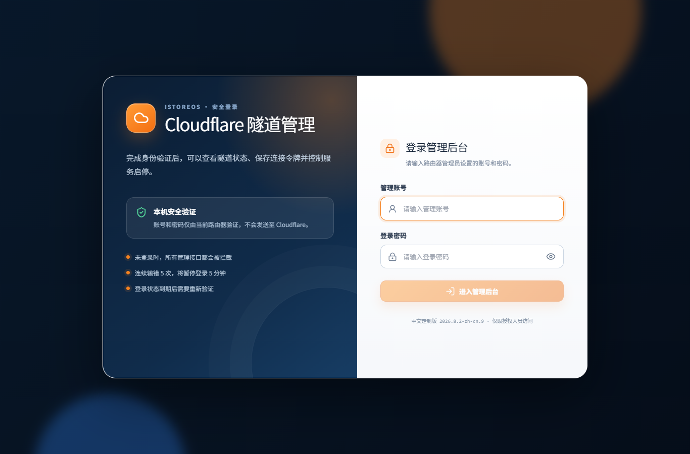
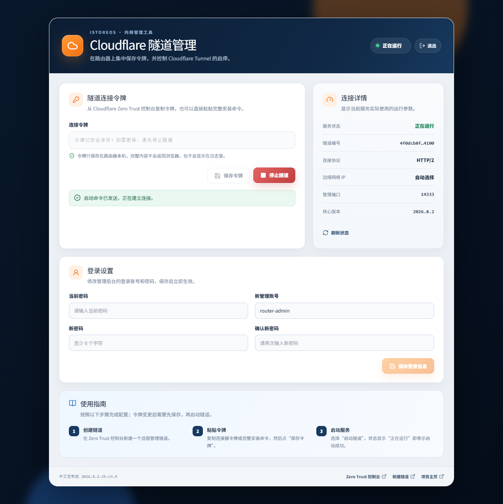

# Cloudflared-web 中文版

[](https://github.com/w87051809/cloudflared-web-zh-cn/releases)
[](https://github.com/w87051809/cloudflared-web-zh-cn/actions/workflows/build.yml)
[](https://github.com/cloudflare/cloudflared/releases/tag/2026.8.3)
[](LICENSE)

面向路由器和内网服务器的 Cloudflare Tunnel 中文管理界面。项目集成 `cloudflared` 核心、Web 管理后台和登录保护，支持在浏览器中管理 Tunnel Token、控制隧道启停并查看当前运行状态。

本项目基于 [WisdomSky/Cloudflared-web](https://github.com/WisdomSky/Cloudflared-web) 修改，继续遵循 GPL-2.0 开源协议。

## 功能概览

- 中文化的登录页面和隧道管理页面
- 基于账号、密码和签名会话 Cookie 的访问控制
- 登录失败次数限制和会话有效期管理
- Tunnel Token 本地持久化与前端脱敏
- 隧道启动、停止及实时运行参数查看
- 管理页面一键更新中文界面与 cloudflared 内核、更新前保留旧版及失败自动回退
- `HTTP/2`、`QUIC` 和自动协议选择
- `linux/amd64`、`linux/arm64`、`linux/arm/v7` 多架构镜像
- 固定版本镜像和 `latest` 镜像发布

## 页面预览

### 登录页面



### 隧道管理页面



## 版本信息

| 项目 | 当前版本 |
| --- | --- |
| 中文定制版 | `2026.8.3-zh-cn.16` |
| cloudflared | `2026.8.3` |
| 默认管理端口 | `14333` |
| 容器镜像 | `ghcr.io/w87051809/cloudflared-web-zh-cn` |
| 支持架构 | `linux/amd64`、`linux/arm64`、`linux/arm/v7` |

## 默认登录信息

| 项目 | 默认值 |
| --- | --- |
| 管理账号 | `admin` |
| 管理密码 | `123456789` |

登录页面不会预填账号或密码。默认信息只允许在可信局域网内首次使用；登录后系统会先要求修改账号和密码，完成修改前，隧道配置、状态和控制接口不会开放。修改后的密码使用 `scrypt` 加盐哈希后保存到 `/config/auth.json`，不会保存明文。

## 部署

### 推荐：经过校验的统一安装器

使用 `root` 登录 Linux、OpenWrt 或 iStoreOS，执行下面这一条命令。命令会下载正式 Release 中的安装器和校验文件，校验通过后才开始安装：

```bash
cd /tmp && curl -fLO https://github.com/w87051809/cloudflared-web-zh-cn/releases/download/v2026.8.3-zh-cn.16/install.sh && curl -fLO https://github.com/w87051809/cloudflared-web-zh-cn/releases/download/v2026.8.3-zh-cn.16/install.sh.sha256 && sha256sum -c install.sh.sha256 && sh ./install.sh
```

统一安装器会一次完成以下工作：

- 同时部署 `cloudflared-web` 管理服务和 `cloudflared-web-updater` 更新服务。
- 自动生成独立的会话密钥和更新通信密钥，不把密钥上传到仓库。
- 发现旧的单容器安装时，保留原 `/config`、Tunnel Token、账号密码和 cloudflared 数据后自动迁移。
- 重复执行时检查现有安装，不会重复创建第二个 cloudflared 隧道实例。
- 核对镜像版本、GitHub 来源和镜像摘要，拒绝未知镜像及版本降级。
- 新服务检查失败时恢复旧容器；安装记录和保留项统一放在 `/www/临时文件`。

安装完成后的管理地址：

```text
http://设备IP:14333
```

### 高级：Docker Compose 部署

需要自行管理 Compose 的用户，可以复制环境变量模板和双服务配置：

```bash
cp .env.example .env
cp docker-compose.example.yml docker-compose.yml
```

编辑 `.env`，把两个示例密钥替换为不同的随机值，然后启动：

```bash
docker compose up -d
```

必须同时保留 Compose 文件中的 `cloudflared-web` 和 `cloudflared-web-updater` 两项服务。只启动第一个容器时，管理页面会显示“更新服务未启用”。不要将 `.env`、Tunnel Token、证书或私钥提交到仓库。

更新服务只通过本机 Unix Socket 接收签名请求。Web 管理容器不会挂载 Docker Socket；只有不开放管理端口的独立更新容器可以访问 Docker 管理接口。

使用默认账号和密码登录后，先按页面要求更换登录信息，再从 Cloudflare Zero Trust 控制台复制 Tunnel Token，在管理页面保存并启动隧道。

环境变量中的账号和密码只用于首次创建 `/config/auth.json`。管理页面修改成功后，以 `/config/auth.json` 中的加密登录信息为准。

## 配置参数

| 参数 | 默认值 | 说明 |
| --- | --- | --- |
| `WEBUI_HOST` | `0.0.0.0` | Web 管理服务监听地址 |
| `WEBUI_PORT` | `14333` | Web 管理服务监听端口 |
| `BASIC_AUTH_USER` | `admin` | 首次启动时使用的管理账号 |
| `BASIC_AUTH_PASS` | `123456789` | 首次启动时使用的管理密码 |
| `WEBUI_SESSION_SECRET` | 随机值 | 会话签名密钥；生产环境应固定设置 |
| `WEBUI_SESSION_HOURS` | `12` | 登录会话有效期，允许范围为 1 至 168 小时 |
| `WEBUI_COOKIE_SECURE` | `auto` | 根据 HTTP/HTTPS 自动设置安全 Cookie，也可指定 `true` 或 `false` |
| `WEBUI_TRUST_PROXY` | `false` | 同容器 cloudflared 或本机可信反向代理转发访问时设置为 `true`，仅信任回环代理 |
| `WEBUI_ALLOW_REMOTE_SETUP` | `false` | 是否允许从公网首次使用默认密码；正式环境不要开启 |
| `UPDATER_SHARED_SECRET` | 随机值 | Web 管理服务与独立更新服务之间的签名密钥，至少 32 个字节 |
| `UPDATER_SOCKET_PATH` | `/run/cloudflared-web-updater/updater.sock` | 本机更新通信路径，不开放 TCP 端口 |
| `PROTOCOL` | `auto` | 隧道连接协议：`auto`、`http2` 或 `quic` |
| `EDGE_IP_VERSION` | `auto` | Cloudflare 边缘连接 IP 版本：`auto`、`4` 或 `6` |
| `EDGE_BIND_ADDRESS` | 空 | 指定隧道连接使用的本地源地址 |
| `METRICS_ENABLE` | `false` | 是否启用 cloudflared 指标服务 |
| `METRICS_PORT` | `60123` | 指标服务监听端口 |

部分运营商线路会限制 QUIC 使用的 UDP 7844。出现隧道连接不稳定时，可以将 `PROTOCOL` 固定为 `http2`。

Cloudflare 控制台中的“副本”表示 cloudflared 运行实例，本项目默认只运行一个实例；每个实例内部仍由 cloudflared 建立 4 条边缘容灾连接。副本数和内部连接数不是一回事，不能通过压缩内部连接来删除副本，否则控制台会显示“降级”。

如果为本管理页面配置 Cloudflare Tunnel 路由，源服务必须填写 `http://127.0.0.1:14333` 或 `http://localhost:14333`，不要填写路由器的局域网 IP。这样首次默认信息只能由可信局域网用户修改，公网请求会按真实来源拦截。

## 安全设计

- 未登录请求无法访问隧道配置、状态和控制接口。
- 默认账号和密码首次登录后必须更换，完成前不会开放管理接口。
- 默认信息只允许在可信局域网内首次修改，公网来源无法使用公开默认密码接管后台。
- 登录账号和密码可以在管理页面修改，密码使用 `scrypt` 加盐哈希保存。
- 登录会话使用 HMAC-SHA256 签名并记录服务端会话，退出登录后立即失效；Cookie 设置 `HttpOnly` 和 `SameSite=Strict`。
- 同一来源连续登录失败 5 次后，将暂停登录 5 分钟。
- 管理服务设有全局请求频率限制，避免接口被持续占用。
- 写入接口只接受同源 JSON 请求，并统一设置安全响应头和禁止敏感内容缓存。
- Tunnel Token 仅保存在容器挂载的 `/config/config.json`，管理页面不会返回完整内容。
- 示例部署启用只读根文件系统、受限临时目录和 `no-new-privileges`。
- Web 管理容器不接触 Docker Socket；更新权限单独放在无网络管理端口的更新容器中，请求必须经过短时效 HMAC 签名并限制到本项目正式镜像。
- 运行镜像采用固定摘要的 Distroless Node.js，不包含 npm、curl、Shell 和系统包管理器。
- cloudflared `2026.8.3` 使用经过 SHA-256 校验的官方标签源码和 Go `1.26.6` 构建，纳入官方 WebSocket 安全修复。
- 合并请求先构建并扫描 amd64 完整候选镜像；正式标签再逐架构扫描实际待发布摘要。存在可修复的高危或严重漏洞时不会发布正式镜像标签。
- 配置目录、环境变量文件和备份文件应限制为管理员访问。

详细安全说明见 [SECURITY.md](SECURITY.md)。

## 更新与回滚

安装 `2026.8.2-zh-cn.10` 或更高版本后，后续版本可在管理页面“系统更新”区域点击“一键更新全部”。每个正式镜像同时包含对应的中文管理界面和 cloudflared 内核，二者不会拆开升级。系统只接受本项目 GitHub 最新公开正式版本，并按以下顺序执行：

1. 核对 GitHub 最新公开 Release。
2. 下载对应的多架构正式镜像，下载期间隧道保持运行。
3. 在 `/www/临时文件` 写入不含密钥的更新记录，并将旧容器改名保留。
4. 启动新版本并检查管理服务；检查失败时自动恢复旧容器。

正式发布前，流水线会核对发布版本、镜像中的管理版本和 cloudflared 内核版本是否一致；不一致时停止发布。该功能不会更新 iStoreOS、OpenWrt 或 Linux 系统内核。

旧的单容器安装只需执行一次统一安装器，原配置会自动迁移并补齐更新服务。以后可以直接使用页面的一键更新，不需要再次逐台补装。

命令行更新仍然保留：

更新：

```bash
docker compose pull
docker compose up -d
```

回滚时，将镜像标签改回上一个已验证版本，再重新执行：

```bash
docker compose up -d
```

一键更新不会删除旧版容器和 `/config`。如果需要手工回滚，可停止当前容器，将保留的 `cloudflared-web-before-auto-update-*` 容器改回 `cloudflared-web` 后启动。

## 从源码构建

```bash
docker buildx build \
  --platform linux/amd64,linux/arm64,linux/arm/v7 \
  -t cloudflared-web-zh-cn:2026.8.3-zh-cn.16 .
```

Dockerfile 会从 Cloudflare 官方标签下载源码归档，核对固定的 SHA-256 校验值后再构建对应架构的内核。

## 许可证与上游项目

- 许可证：[GPL-2.0](LICENSE)
- 上游管理界面：[WisdomSky/Cloudflared-web](https://github.com/WisdomSky/Cloudflared-web)
- cloudflared：[cloudflare/cloudflared](https://github.com/cloudflare/cloudflared)
